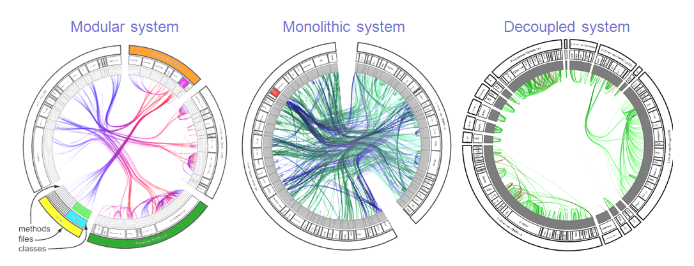

# Holtenizer
Create Hierachirel Edge Bundle diagram as described by [Danny Holten's paper](http://www.aviz.fr/wiki/uploads/Teaching2014/bundles_infovis.pdf)

Python C parser for use with D3.js

Below image is the __goal__ not the result of this tool!


## Usage

Create JSON

```shell
./holtenizer.py test/hello_simple.c > hello_simple.json
```

Start webserver in current folder

```shell
python -m http.server 5000
```

In a browser go to `http://localhost:5000`


### Docker usage

```shell
docker build -t holtenizer .
docker run -it -p 5000:5000 --rm holtenizer
```
